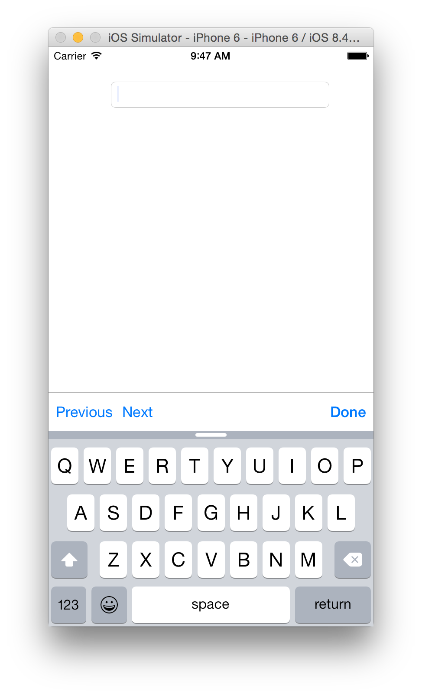
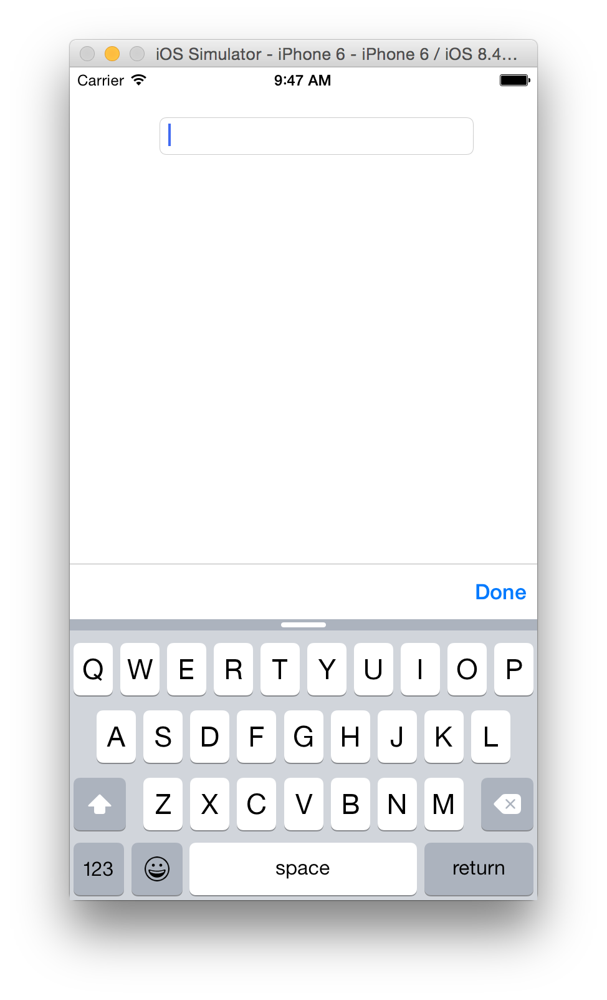

# toolbar-keyboard
UIToolbar category to create toolbars useful for text input views e.g. keyboards or pickers for iOS

### Dependencies 

* [Xcode](https://itunes.apple.com/gb/app/xcode/id497799835?mt=12#)

### Installation

- Add the UIToolbar+KeyboardAdditions.h and UIToolbar+KeyboardAdditions.m file to your project.

### Usage

UIToolbar with Done button

    // Create the toolbar
    
    UIToolbar *toolbar = [UIToolbar doneToolbarWithTarget:self action:@selector(didPressKeyboardDoneButton:)];
    
    // Attach it to the top of a text field's keyboard
    
    self.textField.inputAccessoryView = toolbar;
    
    // ...
    
	- (void)didPressKeyboardDoneButton:(id)sender
	{
	    // Hide keyboard
	    
	    [self.view endEditing:YES];
	}
    
UIToolbar with Previous, Next and Done button 

	// Create the toolbar 
	
    UIToolbar *toolbar = [UIToolbar previousNextDoneToolbarWithTarget:self
                                                       previousAction:@selector(didPressKeyboardPreviousButton:)
                                                         previousText:NSLocalizedString(@"Previous", nil)
                                                           nextAction:@selector(didPressKeyboardNextButton:)
                                                             nextText:NSLocalizedString(@"Next", nil)
                                                           doneAction:@selector(didPressKeyboardDoneButton:)];

	// Attach it to the top of a text field's keyboard
	
	self.textField.inputAccessoryView = toolbar;
    
    // ...
    
    - (void)didPressKeyboardDoneButton:(id)sender
    {
    	// Hide keyboard 

    	[self.view endEditing:YES];
    }
        
	- (void)didPressKeyboardPreviousButton:(id)sender
	{
	    // ...
	}

	- (void)didPressKeyboardNextButton:(id)sender
	{
	
	    // ...
	}

### Screenshots

### Team
* Development: [Shagun Madhikarmi](mailto:shagun@ustwo.com))
